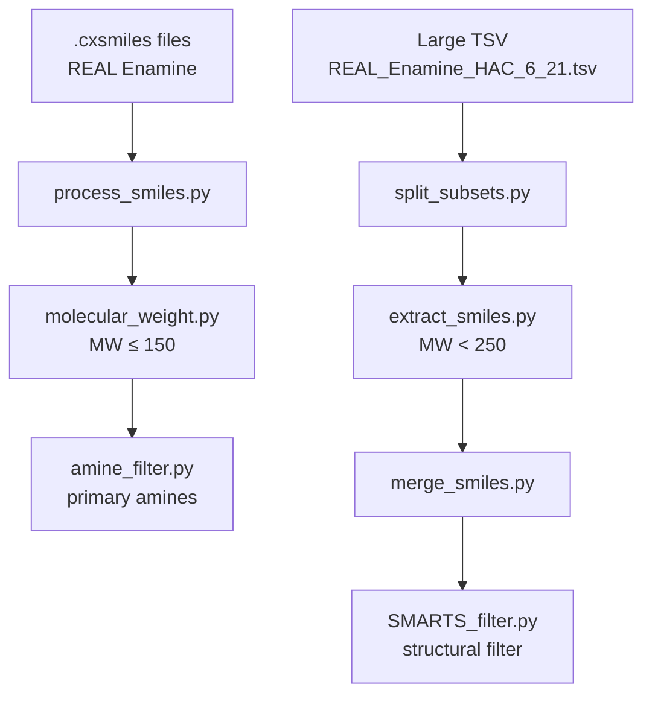

# Scripts — Chemical Library Filtering

A collection of Python scripts to process, filter, and merge compounds from the **REAL Enamine** library. The general workflow starts from `.cxsmiles` or `.tsv` files, applies molecular weight and structural filters (primary amines), and produces subsets ready for downstream analysis.

## Requirements

- Python 3
- [RDKit](https://www.rdkit.org/) (`rdkit`) — `prefiltering/` and `SMARTS_filter/` scripts
- [pandas](https://pandas.pydata.org/) — `utilities/` and `SMARTS_filter/` scripts

## Repository Structure

```
Scripts/
├── prefiltering/       # Conversion and initial filtering of Enamine files (.cxsmiles)
├── utilities/          # Tools to split, extract, and merge TSV files
└── SMARTS_filter/      # Advanced structural filtering using SMARTS patterns
```

---

## `prefiltering/`

Scripts designed to process the REAL Enamine library in numbered batches (`PartList1`, `PartList2`, …). They iterate over ~2797 files and write results to parallel output folders.

### `process_smiles.py`

**What it does:** Converts `.cxsmiles` files into tab-delimited `.smi` files, keeping only the **first two columns** of each row (typically SMILES and identifier).

| Input | Output |
|-------|--------|
| `REAL_Enamine_source/PartList{i}.cxsmiles` | `REAL_Enamine_smi/PartList{i}.smi` |

**Dependencies:** standard library (`csv`).

---

### `molecular_weight.py`

**What it does:** Filters compounds with **molecular weight (MW) ≤ 150 Da**, calculated with RDKit (`Descriptors.MolWt`). Molecules that cannot be parsed are discarded.

| Input | Output |
|-------|--------|
| `REAL_Enamine_smi/PartList{i}.smi` | `REAL_Enamine_size_smi/PartList_size{i}.smi` |

**Dependencies:** RDKit, `csv`.

---

### `amine_filter.py`

**What it does:** Keeps only compounds containing at least one **primary amine** (`NH₂`), detected by counting nitrogen atoms with two bonded hydrogens.

| Input | Output |
|-------|--------|
| `REAL_Enamine_size_smi/PartList_size{i}.smi` | `REAL_Enamine_filtered_size_smi/PartList_filtered_size{i}.smi` |

**Dependencies:** RDKit, `csv`.

**Suggested order in this folder:** `process_smiles.py` → `molecular_weight.py` → `amine_filter.py`

---

## `utilities/`

Tools for handling large TSV files and consolidating results from previous filtering steps.

### `split_subsets.py`

**What it does:** Splits a large TSV file into chunks of **500,000 rows** to enable batch processing.

| Input | Output |
|-------|--------|
| `REAL_Enamine_HAC_6_21.tsv` | `REAL_Enamine_HAC_6_21_{n}.tsv` (one file per chunk) |

**Dependencies:** pandas.

---

### `extract_smiles.py`

**What it does:** Reads a TSV file, filters rows with **MW < 250**, and extracts the `smiles` and `idnumber` columns. Saves the result to an output file specified as a command-line argument.

**Usage:**

```bash
python extract_smiles.py <input_file.tsv> <output_file.tsv>
```

**Dependencies:** pandas.

---

### `merge_smiles.py`

**What it does:** Combines all `.tsv` files in a directory into a single file, keeping only the `smiles` and `idnumber` columns.

| Input | Output |
|-------|--------|
| `REAL_Enamine/filter250/*.tsv` | `REAL_Enamine_250.tsv` |

**Dependencies:** pandas, `glob`.

---

## `SMARTS_filter/`

### `SMARTS_filter.py`

**What it does:** Applies an **advanced structural filter** to a compound TSV file. A molecule passes the filter only if it meets **all** of the following conditions:

1. **Exact molecular weight ≤ 200 Da** (`AllChem.CalcExactMolWt`).
2. Presence of a **primary amine** (SMARTS pattern `[NH2]`).
3. **Structural environment** around the primary amine:
   - **Case A:** the carbon neighbor of the amine has degree 1 (bonded only to the amine) and forms a `C–C` chain where the second carbon has exactly 3 neighbors, with constraints on atoms that can form hydrogen bonds or coordinate hydrogens (`N`, `O`, `F`, `Cl`, `I`).
   - **Case B:** the carbon neighbor has degree 2 and its two additional neighbors are terminal atoms among `N`, `O`, `F`, `Cl`, or `I`.

| Input | Output |
|-------|--------|
| `REAL_Enamine_250.tsv` | `Filtered_REAL_Enamine_250.csv` |

**Dependencies:** RDKit, pandas.

---

## Suggested Workflow



1. **Enamine pre-filtering:** convert `.cxsmiles` → filter by weight → filter by primary amine (`prefiltering/`).
2. **TSV processing:** split the large file, extract SMILES with MW < 250, and merge the chunks (`utilities/`).
3. **Final filtering:** apply strict structural criteria with SMARTS (`SMARTS_filter/`).

---

## Notes

- Input and output paths are **hardcoded** in each script; adjust them for your environment before running.
- The `for i in range(1, 2798)` loops in `prefiltering/` correspond to the ~2797 files in which Enamine distributes the REAL library.
- Make sure the output directories exist (`REAL_Enamine_smi/`, `REAL_Enamine_size_smi/`, etc.) before running the corresponding scripts.
